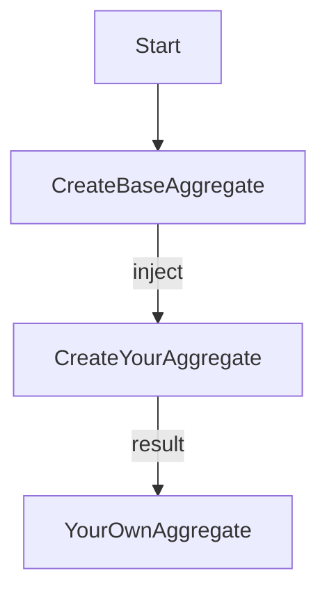

# Domainex

`DomainEx` is an Elixir library which provides a set of common typespec and domain models and also provides
a set of function helpers for basic function and domain building  

# About Domainex

## Why TypeSpces

Elixir is not a static typing language, it's dynamic typing, which mean when we doesn't need to define any variable
or function type parameters. But Elixir provides their `TypeSpecs` that really useful to: 

- Documentation. I'm one of believer that good (and beautiful) code documentation is important
- Code analysis using `Dialyzer`

When I begin to learn Elixir's *typespec* , I'm starting to learn the mental model, and I really like it. The typespec
actually is *just* a *typehint* , but somehow I've felt that the type specification mechanism still able to help us to provide rich modeling domain business and in the same time can help us to building a great domain business documentation
from our codes.

The `Domainex` provides common types such as: 

```elixir
  @type error :: {:error, {error_type(), error_payload()}}
  @type success :: {:ok, any()}
  @type result :: success() | error()
```

## Domain Driven Design

Although Elixir is not a static type language, we are still possible to modeling business needs by take a leverage of *typespec*.

`Domainex` also build with purpose to provide a helpers and also *specs* to define some common DDD concepts.

### Aggregate

```elixir
  @type aggregate_name :: String.t() | atom()
  @type aggregate_payload :: struct() | map()
  @type aggregate :: {:aggregate, Aggregate.Structure.t()}
```

The main aggregate's structure will be like this: 

```elixir
    @enforce_keys [:name, :contains, :events, :processors]
    defstruct [:name, :contains, :events, :processors]

    @type t :: %__MODULE__{
      name: BaseType.aggregate_name(),
      contains: BaseType.aggregate_payload() | %{atom() => BaseType.aggregate_payload()},
      events: list(BaseType.event()),
      processors: list(module())
    }
```

Initiate new aggregate: 

```elixir
    fake_entity = %FakeEntityStruct{name: "fake_entity"}
    aggregate = Aggregate.new(:fake_entity, fake_entity, [FakeEventProcessor])
```

Initiate new aggregate with multiple entities:

```elixir
    fake_entity_1 = %FakeEntityStruct{name: "fake_entity_1"}
    fake_entity_2 = %FakeEntityStruct{name: "fake_entity_2"}
    aggregate = Aggregate.new(:fake_agg, %{:fake1 => fake_entity_1, :fake2 => fake_entity_2}, [FakeEventProcessor])
```

#### Aggregate and Functional Programming

We should treat an `aggregate` as a *single unit* of business domain, which mean, we should put our business logic inside an `aggregate`. It is a common to create an *object* which in OOP will be a *class* that hold refences to its internal states and behaviors based on business needs. There is a chance that some of aggregates need some common states,properties or even activities, maybe something like emitting domain event. All of these common properties and behaviors can be grouped into some *base aggregate* which will be inherited by other child aggregates. 

The problem is, I rarely see such a thing in functional languages, including in Elixir. There is no way to *extend* from some defined *structure* or a `struct()`.

In functional, actually it help us to made all things becomes more simpler. There are no *internal states*, no *inheritance*. There are just an input parameters and a functions. An input parameter is just a *value* , and a function used to do some computation, transform a *value* to other *value*.

```
|-------|            |-----------|        |---------|
| input | ---------> |  function |------->|  output |
|-------|            |-----------|        |---------|
```

Even better, each of *value* is also *immutable* , so there is no chance that we can *update* the value directly, what we can do is create another new value based on some given values.

If we can't *extend* this `aggregate()` type and structure, then how do we use it in our real application, real business needs ?

There is no chance to *extend*, **but**, we can use this `DomainEx.Aggregate.Structure` as a *value*, and use all of available functions form `Domainex.Aggregate` as a helper functions, as long as the input value following spec: 

```elixir
  @type aggregate :: {:aggregate, Aggregate.Structure.t()}
```

You are still free to create your own `aggregate` based on your business needs, `Domainex` will not limiting the solution or force you to follow some rules.

Example of possible solutions : 

```elixir
  defmodule My.Aggregate do
    defmodule Structure do
      # The `:base` property defined here used to store our `aggregate()` type
      defstruct [:base, :field1, :field2]
    end

    @spec new(base :: Domainex.aggregate())
    def new(base) do
      %Structure{
        base: base
      }
    end

    @spec your_business_activity(structure :: Structure.t()) :: {:ok, term()} | {:error, term()}
    def your_business_activity(structure) do
      # do whatever you needs
    end
  end
```

So, the logic flow become like this: 



> Please remember, that since the `Domainex.Aggregate` which act as base aggregate used as a *value*, it needs to always be passed as a function parameters. 

### Domain Event

```elixir
  @type event_name :: atom()
  @type event_payload :: struct() | map()
  @type event :: {:event, Event.Structure.t()}
```

The main event's structure will be like this: 

```elixir
    @enforce_keys [:name, :payload, :timestamp]
    defstruct [:name, :payload, :timestamp]

    @type t :: %__MODULE__{
      name: BaseType.event_name(),
      payload: BaseType.event_payload(),
      timestamp: DateTime.t()
    }
```

By default you almost doesn't need to do anything with these domain event structure and even its *specs*. When you
initiate a new aggregate, it will also initiate an empty events.

Aggregate and domain events will follow `Observer` design pattern. When you initiate an aggregate, you need to register
some event's processor, like an example above.  An `Event.Processor` is a Elixir's *behaviour*, or an *interface* called in other languages.

Each time you `emit_events/1` from an aggregate, it will send all available aggregate's event to its event's processor. Its up to the module which implement `Event.Processor` to do anything with given event list, maybe doing some computation using Elixir's `GenStage`.  

## The power of Tuple

When I learning Elixir, I've seen a lot of *tuple* used to grouping some context. Let just take our previous sample for return values : 

```elixir
  @type error :: {:error, {error_type(), error_payload()}}
  @type success :: {:ok, any()}
  @type result :: success() | error()
```

In the first time, it just look *weird*, but after learn more, I just think that it actually a reall simple and powerfull concept. We can use *tuple* to build a set of context from some value, not just its *type* but also the *context*, what kind of information do we get from some value. From the example above, when we got the information that the *value* is a *succes* or an *error*, we know how to handling it.

It's same with previous *aggregate*. By just defining an *aggregate* as a *tuple* , when we got a *value* which is a *tuple* and the first element is `:aggregate`, what we need to do next is extract the following elements like for `aggregate_name` and it's payload.

And thanks to Elixir's pattern matching its really simple to *match* and *extract* tuple values

```elixir
iex(1)> {typed, value} = {:ok, "hello world"}
{:ok, "hello world"}
iex(2)> typed
:ok
iex(3)> value
"hello world"
iex(4)> 
```

# Installation

If [available in Hex](https://hex.pm/docs/publish), the package can be installed
by adding `domainex` to your list of dependencies in `mix.exs`:

```elixir
def deps do
  [
    {:domainex, "~> 0.1.0"}
  ]
end
```
